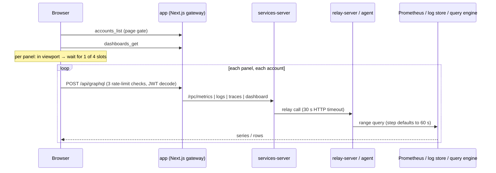

# Custom dashboard load performance

> **Status:** 2026-09-05 — reproduced (browser tab froze) and the first fix shipped; see [What shipped](#what-shipped).
> **Symptom:** opening a custom dashboard shows panel skeletons for a long time and reads as a page hang. With
> enough series per panel the tab itself freezes.
> **Repro:** import [`fixtures/expensive-dashboard-stress-test.json`](fixtures/expensive-dashboard-stress-test.json)
> (111 panels, every query expensive on purpose, each panel's description says why) and open it on Last 7 days.

## Summary

Loading the dashboard record is fast (15 ms median). The panels are the hang. Every panel is one
provider round trip with no size bound, no timeout and no cache, admitted four at a time, and one slow
logs or traces panel pins a slot for the full 15 s slot timeout. Long time ranges make it worse on both
sides: no step is sent, so a 7-day range is 10k points per series to fetch and to draw.

**Recommendation:** bound every panel query (step, server deadline, client abort) and add per-panel
timing first. Both are small. Then choose between a server-side batch action and caching from the
measurements, not from guesswork.

## How a dashboard loads today

Three serial round trips happen before the first panel query starts. Nothing renders until the
account list answers.

## Evidence

Backend latency, services-server, dev, 7 days to 2026-09-03 (Datadog APM):

| Route | p50 | p95 | max | Used by |
|---|---|---|---|---|
| /rpc/metrics | 76 ms | 2.1 s | 45 s | metrics panels |
| /rpc/logs | 34 ms | 30 s | 160 s | logs panels |
| /rpc/traces | 75 ms | 9 s | 60 s | traces panels |
| /rpc/query | 39 ms | 2.9 s | 49 s | entity panels |
| /rpc/dashboard | 15 ms | 131 ms | 5.6 s | get, list, entity execute |

What the code does:

- **Admission queue of 4, slot timeout 15 s.** Visible panels wait for a slot; a slot is held until
  the first fetch settles. One slow logs panel holds a slot for 15 s and everything behind it waits.
- **No step on metrics queries.** The panel sends none, the agent defaults to 60 s. A 7-day range is
  10k points per series. Chart.js then draws every point with no decimation.
- **No client-side timeout.** The slot frees at 15 s but the panel keeps its skeleton until the relay's
  30 s or the database's 120 s bound fires. If nothing fires, forever.
- **No cache, no dedupe.** Every open, every Refresh and every extra viewer re-runs every panel cold.
  Built-in templates carry 6 to 11 panels and repeat the same events and spend queries across panels.
- **13 outliers on /rpc/dashboard on 2026-09-03, all 5.2 to 5.6 s.** The trace has no child spans, so
  the cause is unattributed. Likely entity panels on the events tables, the same class as the closed
  stale-planner-stats issue. The autoanalyze tuning for `events` landed in main on 2026-09-01.
- **The app tier is invisible.** No Next.js service reports to APM and RUM is off. Nobody can currently
  split network wait from main-thread stall.

Worked example, 11 panels, 4 slots: at p95 metrics latency the dashboard fills in three waves of about
2 s. One slow logs panel is absorbed, the other three slots carry the rest in about 8 s. The collapse is
when slow panels fill every slot: two logs and two traces panels above the fold hold all four slots
(traces release at 9 s, logs at the 15 s slot timeout), so the first metrics panel below them starts at
9 s and the last one draws at 17 s, while the logs panels keep spinning to 30 s. A wedged provider
leaves a skeleton with no error and no Retry.

## How Grafana handles the same problem

| Mechanism | Grafana | Nudgebee today |
|---|---|---|
| Query size | `maxDataPoints` from panel width; interval = range / points, used as Prometheus `step`, hard cap 11k points | no step; agent default 60 s |
| Range alignment | start and end floored to the step, so refreshes repeat the same query and result caches hit | raw `Date.now()` bounds |
| Lazy loading | off-screen panels do not query; on-screen panels all fire at once | same lazy gate, plus a 4-slot browser queue |
| Timeouts | data-proxy timeout, default 30 s; panel shows a timeout error; in-flight queries cancelled on unmount or range change | no client abort; relay 30 s; DB 120 s |
| Caching | Enterprise and Cloud: key = data source + query + rounded range, TTL per data source (default 1 min), per-panel override | none |
| Shared queries | `-- Dashboard --` data source reuses another panel's result | none |
| Long log queries | Loki query-frontend splits by interval, runs chunks in parallel, caches each chunk | one request per account |
| Rendering | uPlot, canvas, no animation | Chart.js, animation off, no decimation |
| Per-panel visibility | query inspector: request time, rows, processing time | none |

## Options

| # | Option | Effort | Removes | Notes |
|---|---|---|---|---|
| 1 | **Bound every panel request.** Step sized to ~200 points per range. Client abort at 30 s with an error state and Retry. Per-request deadline on the Go side for metrics, logs and traces. | S | endless skeleton, long-range blow-up | **Shipped** (see What shipped), except the Go-side deadline |
| 2 | **Instrument.** Operation name on gateway spans and logs, app spans exported to APM, per-panel time-to-data metric. | S | blind spots | prerequisite for choosing 3 vs 4 |
| 3 | **One batch action per dashboard.** Server fans out with a shared deadline, streams results as they settle. | L | 4-slot cap, per-panel auth and rate-limit overhead, slot starvation | new API contract, needs a `/challenge` pass |
| 4 | **Cache and dedupe.** Server-side singleflight plus 30 to 60 s TTL keyed on tenant, account, provider, query, step-rounded range. Client keeps the last result per panel and shows it while refreshing. | M | repeated cost across viewers and Refresh | needs range rounding from option 1 or keys never repeat |
| 5 | **Queue tuning.** Raise the 4-slot cap if the ingress serves HTTP/2. | S | marginal | browser's 6-connection limit does not apply on h2 |
| 6 | **Slow entity tables.** Confirm the autoanalyze tuning is applied on dev and prod; add DB child spans so the 5 s outliers can be attributed. | S | unexplained 5 s stalls | |

Ship 1 and 2 now. Pick 3 or 4 once the per-panel numbers say which dominates: fan-out overhead points
to 3, repeated identical queries point to 4.

## Why the browser froze, not just waited

The stress fixture reproduced a frozen tab, which is a main-thread problem the backend numbers above
cannot explain on their own:

- Every metrics panel hands each series to Chart.js as its own dataset. A per-pod subquery came back
  as 4,798 series, about 288k point elements, built synchronously in one render.
- The HTML legend creates one DOM button per series and computes min, max and average for each.
- The queue admits four such panels at once, and every settled panel re-renders on each parent
  state change.
- At Last 7 days the same panels return 10k points per series, so the JSON alone is tens of megabytes.

Measured on dev VictoriaMetrics with the fixture's own expressions at the default 1 h view: the per-pod
p99 subquery took 6.3 s and returned 4,798 series / 282k points; a per-pod `predict_linear` returned
5,836 series / 337k points. Dev is a small cluster.

## What shipped

The first PR bounds what one panel fetches and what it draws. Same shape as every product surveyed
below: Cloud Monitoring draws at most 50 series, New Relic facets default to 10, Datadog caps a line
at 1,500 points, Grafana sizes the step to the panel width, Prometheus 3 has a `limit` parameter on
`/query_range` "because too many series can crash browsers".

- **Step sized to the panel.** A range query sends `step_interval` for about 200 points per series,
  snapped to a clean ladder (15 s … 1 d) so refreshes repeat the same query. Last 7 days is now 168
  points per series instead of 10,080. The step travels metrics request → services-server →
  relay → agent, which already honoured it; the Prometheus source simply never forwarded it.
- **Draw cap.** A chart keeps the 20 busiest series (largest magnitude), a table 500, and the panel
  says "Showing the 20 busiest of 4,798 series. Add an aggregation such as sum by (…)". The cut
  happens before alignment, so the dropped series are never aligned or drawn.
- **Tables query instant.** Stat, gauge and table panels show one value per series, so they now send
  `instant: true`. A table used to run the full range and keep the last point — a 24 h increase
  recomputed at every step, then discarded.
- **Panel deadline.** A panel aborts its request after 30 s and shows "No answer after 30s. Retry,
  or narrow the query." instead of a skeleton. The abort also frees the browser connection; the
  traces client takes no signal yet, so there the deadline alone applies.

Not in that PR, still open from the options table: the server-side series and sample budget on the
metrics handler (protects every caller, api-server PR), the per-panel timing in APM, and the batch
action or cache decision.

## How we will know it worked

- Open the three heaviest templates on dev: every panel shows data or an error within 30 s, never a
  permanent skeleton.
- Set a metrics panel to Last 7 days: the response carries about 200 to 300 points per series, and the
  chart draws without a visible stall.
- Pull a provider offline and open a dashboard: the affected panels show an error with Retry; the other
  panels still fill.
- Per-panel time-to-data p95 is visible in APM for the dashboards page.

## Open questions

- Does the ingress serve HTTP/2 to the app? Decides whether option 5 is worth anything.
- Is the `events` autoanalyze tuning applied on dev and prod databases, not just in main?
- Which action produced the 5 s /rpc/dashboard outliers? Needs DB child spans to answer.

Method, files and sources

**Where each fact lives**

- Page gate and serial load: `app/src/pages/dashboards/index.tsx`, `app/src/components/k8s/dashboards/CustomDashboards.tsx`
- Per-panel fetch, no step, no abort: `app/src/components/k8s/dashboards/usePanelData.ts`
- Viewport gate: `app/src/components/k8s/dashboards/DashboardPanel.tsx`
- 4-slot queue, 15 s slot timeout: `app/src/components/k8s/dashboards/panelQueue.ts`
- Metrics request already accepts `step_interval`: `app/src/api1/observability/index.ts`
- Gateway per-request cost (rate limits, auth): `app/src/lib/graphqlGatewayHandler.ts`
- Dashboard get and entity execute: `api-server/services/dashboard/service.go`, `entity_query.go`
- Prometheus via relay, no step forwarded: `api-server/services/observability/prometheus.go`, `api-server/services/relay/service.go`
- Agent step default of 60 s: k8s-agent `runner/pkg/enrichers/prometheus.go`
- Query-engine statement bound (120 s): `api-server/services/query/sql.go`
- Events autoanalyze tuning: migration V906

**Latency data:** Datadog APM, `service:services-server resource_name:POST /rpc/*`, 7 days ending
2026-09-03, grouped by resource. The 5 s outliers are `POST /rpc/dashboard` spans with `@duration > 1 s`
on the same day.

**Grafana sources**

- [Interval and max data points calculation in Prometheus queries](https://community.grafana.com/t/interval-and-max-data-points-calculation-in-prometheus-queries/56665)
- [Prometheus query editor](https://grafana.com/docs/grafana/latest/datasources/prometheus/query-editor/)
- [Data source management, query caching](https://grafana.com/docs/grafana/latest/administration/data-source-management/)
- [Query caching in Grafana Cloud](https://grafana.com/blog/reduce-costs-and-increase-performance-with-query-caching-in-grafana-cloud/)
- [A closer look at lazy loading Grafana dashboards](https://grafana.com/blog/2019/07/08/a-closer-look-at-lazy-loading-grafana-dashboards/)
- [Data-proxy timeout](https://community.grafana.com/t/what-exactly-does-the-setting-of-dataproxy-timeout-control/25643)
- [Loki query performance guide](https://grafana.com/blog/2023/12/28/the-concise-guide-to-loki-how-to-get-the-most-out-of-your-query-performance/)
- [Share query results with another panel](https://docs.aws.amazon.com/grafana/latest/userguide/v10-panels-query-share.html)
- [Panel inspect view](https://docs.aws.amazon.com/grafana/latest/userguide/v10-panels-panel-inspector.html)

