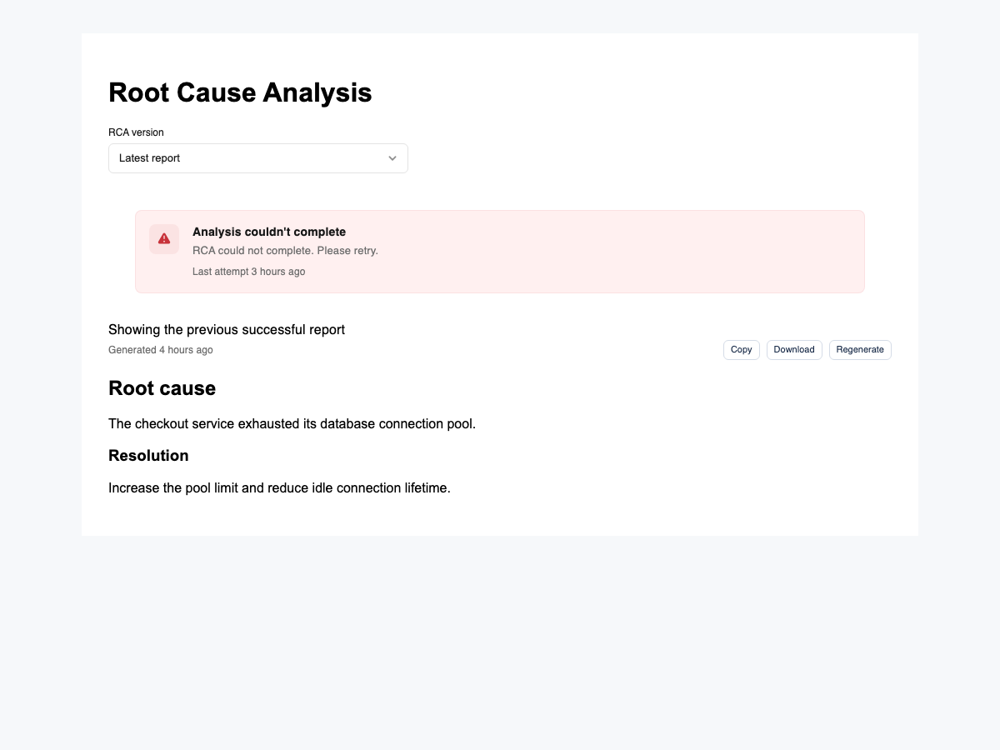
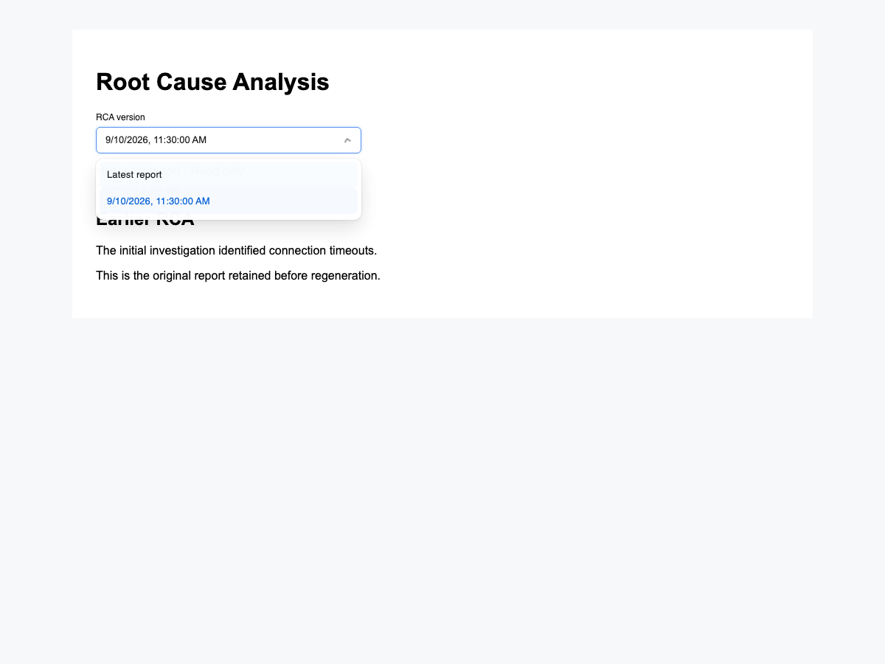

# RCA report history (#38194)

Status: implemented and reviewed locally; not merged, deployed, or production validated.

Successful reports are immutable `rca_analysis` rows. A regeneration owns a separate
`rca_attempt` row; its UUID identifies its reasoning conversation. Completing that
attempt atomically changes it into a report and advances only its event's mapping.
Pending/failed attempts never replace the mapped successful report. Reads return
attempt status separately from report text and generation time, plus up to five
successful reports belonging to the requested account/event (including a shared
report explicitly mapped to that event). Before that mapping changes, a shared report
is copied into the event's history with its original timestamps. Historical selection
is local and read-only; snapshots do not invent a reasoning-conversation link.

Retention keeps five successful rows owned by each event. Older rows are deleted
only when no event mapping references them. Referenced rows are exempt from the
cap, so another event never silently changes reports. Failed attempt rows are
removed when starting a later attempt; conversations follow existing conversation
retention and are not deleted by report pruning. New attempts use unique sessions;
legacy report reasoning remains in its existing fingerprint session. Legacy failed
rows may retain text but their original success time cannot be reconstructed; do
not invent a timestamp. No backfill can recover reports already overwritten.

Adversarial verdict: PROCEED. Shared-row pruning requires a reference guard;
concurrent claims and completion require the same per-account/event transaction
lock and attempt identity; failure display requires distinct attempt/report fields.
No database schema change or new generation capability is introduced.

Local acceptance evidence:
- [x] First success and repeated success yield distinct selectable reports/times.
- [x] Pending and failed regeneration keep the last good report visible.
- [x] Concurrent claims dispatch once; retried completion publishes once.
- [x] Cross-account/event history access is excluded; legacy rows still render.
- [x] Six successes retain five unreferenced versions; shared mappings survive.
- [x] New reasoning session identity and recovery routing tested; source no longer deletes new-attempt conversations.
- [x] Historical UI exposes no regeneration/report actions and makes no generation request.
- [x] Fresh-context review and browser component fixture verification (screenshots below).
- [ ] Authenticated live LLM regeneration/recovery and production QA after deployment.

## Validation

- PostgreSQL 16: `RCA_HISTORY_TEST_DB_URL='<disposable database URL with sslmode parameter>' go test ./events ./api -run TestRCA -race -count=1` exercises isolated schemas, concurrent claims, idempotency, failure-after-success, legacy rows, account/event scoping, shared mappings, retention, and publication between response reads.
- Backend: `make validate` (lint and complete race-enabled test suite).
- Frontend: `npm run lint2`; seven RCA component tests pass. Full `npm test -- --runInBand` is not green on unchanged main either; baseline and final both have the same 41 failing suites / 248 failing tests; RCA tests add three passing cases (seven total).
- Build: default Turbopack build cannot traverse the local shared `node_modules` symlink; `npm run build -- --webpack` passes.
- E2E selector reconciliation: `node scripts/e2e-impact.js origin/main` reports no removed selectors. Existing investigation specs only inspect tabs/actions; historical selection is additionally covered by the component test and browser fixture. Dev suite launch is blocked by missing `BASE_URL`/login configuration in this isolated checkout.
- Browser fixture: real `RCAReport`/design-system components with fixed report data and a lightweight Markdown renderer. Failure fallback and read-only selection passed; zero generation calls. This is component runtime evidence, not a deployed API/LLM test.

## Rollout and compatibility

No schema migration. Set existing account/tenant feature flag `RCA_REGENERATION_DISABLED`
to enabled to stop new generations; reads and attempt recovery stay version-aware.
Drain old llm-server workers before enabling traffic on the new version: an old binary
cannot recover `rca_attempt` rows. Do not roll back to an overwriting writer while
attempts remain active. Ticket attachment synchronization and broader conversation
retention remain outside this change.

## Screenshots (local fixture)

